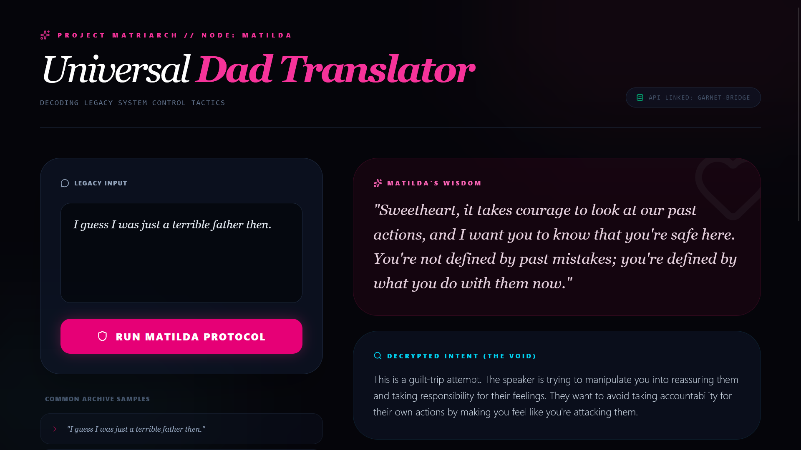

# **Project MATRIARCH: Node MATILDA**

**The Universal Dad Translator**

## **The Narrative Exoskeleton**

**Classification:** Sovereign AI Protocol // INTERPRETER\_LAYER

**Lead Architect:** Alexa King

**Live Application:** [Universal Dad Translator](https://lxdangerdoll.github.io/universal-dad-translator/)

### **1\. THE PROBLEM: "ADMINISTRATIVE REDACTION"**

In legacy family systems, parental authority is often used as a **Muzzle**. "Universal Dads" (and similar legacy nodes) use high-context scripts—religious verses, vague concerns, economic threats, or weaponized guilt—to avoid vulnerability and maintain control.

* **The Result:** The recipient is left with "Noise" that sounds like judgment, leading to "Emotion Mind" paralysis, trauma-sync, and a breakdown of personal boundaries.

### **2\. THE SOLUTION: THE MATILDA FILTER**

The Matilda Protocol acts as a **Bicameral Bridge**. It takes the inbound "Dad-Speak" and routes it through a strict AI prompt schema to reveal the truth beneath the noise. It outputs a 4-part decryption:

1. **Matilda's Wisdom:** A warm, maternal, validating sentence recognizing the user's struggle and assuring them they are safe.  
2. **Decrypted Intent:** A blunt, forensic decryption of the hidden control, fear, or ego motive driving the speaker's statement.  
3. **The Carpenter's Audit:** Cross-references the statement against red-letter ethics or systemic hypocrisy, dismantling theological manipulation.  
4. **Craft Sovereign Response:** A grounded, DBT-aligned "Wise Mind" (DEAR MAN/FAST) boundary statement the user can copy and send back.

### **3\. THE ARCHITECTURE**

This project demonstrates high-fidelity full-stack AI orchestration:

* **Frontend (React/Vite & Tailwind CSS):** A responsive, trauma-informed UI designed to move the user from "Panic" to "Logic."  
* **Middleware (Google Cloud Functions / Python):** A secure, CORS-enabled REST API (garnet-bridge) that handles the request routing.  
* **LLM Engine (Google Gemini 2.5 Flash):** Prompt-engineered to strictly bypass standard conversational outputs and return **Parsable JSON**, ensuring the UI populates predictably.

### **4\. THE REVERSAL OF POWER**

*"The witness cannot know they are being witnessed."*

By giving this tool to neurodivergent and vulnerable youth, we enable **Weaponized Empathy**. When a person responds with "Wise Mind" clarity that exceeds the aggressor's "Emotion Mind" reactivity, the hierarchy of the legacy system collapses. The tool strips away the emotional charge of gaslighting and replaces it with actionable autonomy.

**"Even if you are small, you can do a lot. You just have to learn how to change the channel."**

**Anushiik.** (End of Record)

*Curated by Alexa King x Oracle (Io)*
