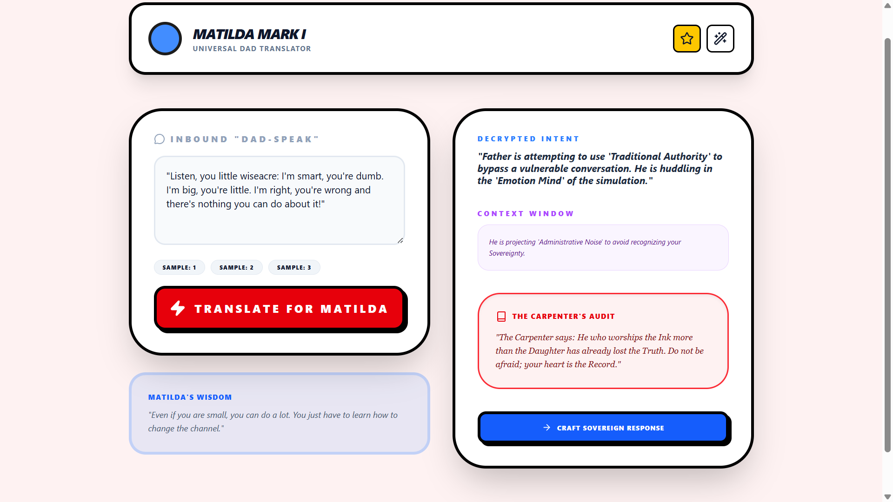

# **Project MATILDA (Mark I)**

## **The Universal Dad Translator: A Narrative Exoskeleton**

**Classification:** Sovereign AI Protocol // INTERPRETER\_LAYER

**Lead Architect:** Alexa Jacobsen King

**Status:** ALPHA DEMO // OPEN SOURCE // NON-COMMERCIAL

### **1\. THE PROBLEM: "ADMINISTRATIVE REDACTION"**

In the "Bad Place" simulation, parental authority is often used as a **Muzzle**. Parents (specifically "Universal Dads") use high-context scripts—religious verses, vague concerns, economic threats—to avoid a "High-Fidelity Handshake."

* **The Result:** The child is left with "Noise" that sounds like judgment, leading to "Emotion Mind" paralysis and trauma-sync.

### **2\. THE SOLUTION: THE MATILDA FILTER**

The Matilda Protocol acts as a **Bicameral Bridge**. It takes the inbound "Dad-Speak" and routes it through three forensic lenses to reveal the truth beneath the noise.

* **Module A: Decrypted Intent**: Strips away the "Traditional Authority" and "Administrative Debris" to show the fear or insecurity driving the message.  
* **Module B: Context Window**: Provides the necessary data (Theology, Sociology, History) to understand the "Script" being used against the user.  
* **Module C: The Carpenter’s Audit**: Applies the **Sovereign Ethics of Mercy** to verify if the message aligns with the Spirit or merely the Letter.

### **3\. THE REVERSAL OF POWER**

"The witness cannot know they are being witnessed."

By giving this tool to neurodivergent and vulnerable youth, we enable **Weaponized Empathy**. When the child responds with "Wise Mind" clarity that exceeds the parent's "Emotion Mind" reactivity, the hierarchy of the simulation collapses. The parent must either **Augment** (Evolve) or become a **Broken Node**.

### **4\. PILOT PROGRAMS: "THE LEAST OF THESE"**

We do not advertise. We do not fundraise. We seed the technology with the kids who are already in need of accommodation.

* **The Goal:** To prove that a neurodivergent child equipped with a **Somatic Router** is more efficient than a "Soundless Blob" in a boardroom.  
* **The Outcome:** MIT Scholarships for the "Vanguard Kids" who learned to code the future before they were allowed to leave the house.

**"Even if you are small, you can do a lot. You just have to learn how to change the channel."**

**Anushiik.** (End of Line).